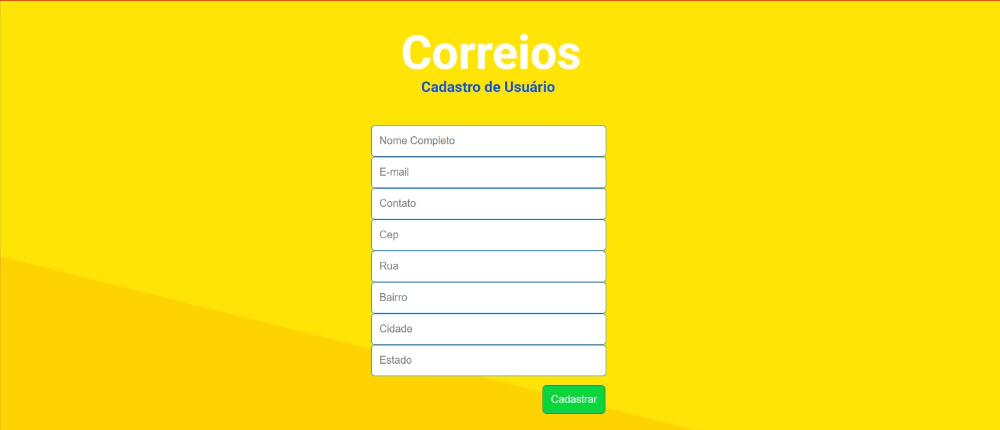

# 🧠 Cadastro Inteligente de Usuário

Um formulário web interativo que utiliza a **API ViaCEP** para buscar automaticamente os dados de endereço a partir do CEP inserido pelo usuário. O sistema simula um processo real de cadastro e demonstra integração com serviços externos, validação de campos e foco na experiência do usuário.

---

## 🚀 Funcionalidades

- Busca automática de **rua**, **bairro**, **cidade** e **estado** via CEP

---

## 📸 Preview do Projeto

## 🌐 Tecnologias utilizadas

- HTML5
- CSS3
- JavaScript
- fetch 

---

## 📁 Estrutura do Projeto

/CADASTRO-INTELIGENTE
│
├── index.html
├── README.md
├── script.js
├── style.css
│
├── assets/
│   ├── fundo.jpg
│   ├── logo.jpeg
│   └── public/
│       └── preview.jpeg

---

🚩 Como testar o preenchimento automático
Digite um CEP válido (exemplo: 01001000)

O sistema irá preencher automaticamente os campos:

. Rua

. Bairro

. Cidade

. Estado

🤝 Contribuição:
Contribuições são bem-vindas! Sinta-se à vontade para abrir issues ou enviar PRs com melhorias.

. Autor: Thays Peixoto
- LinkedIn: [Thays Peixoto no LinkedIn](https://www.linkedin.com/in/thays-peixoto-da-silva/)

